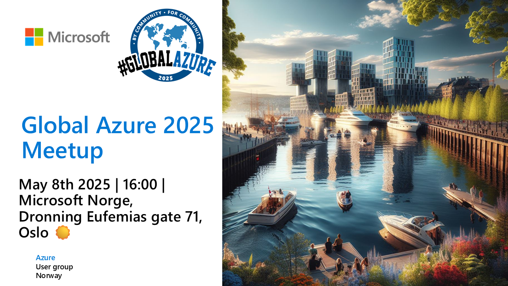

# Global Azure 2025 - Azure User Group Norway

Global Azure 2025 will once again be supported by Azure User Group Norway!

## AUGNorway supports Global Azure via In-Person Meetups

We aim to support Global Azure 2025 (https://globalazure.net) by organizing at least one in-person meetup, during the days of May 8th to May 10th, 2025.

Planning is underway, and we have our primary location confirmed, at Microsoft Norway offices, se below links. We are open for organizations and members of our network that would like to sponsor and contribute to a regional event. See more info under sponsors below.

### Oslo

Our Global Azure Meetup event for Oslo is being sponsored by [Microsoft Norge](https://www.microsoft.no/)!

## Speakers

Do you want to speak and present a session at one of our Global Azure events in Norway? Submit your session at our CfP link: https://sessionize.com/global-azure-norway-2025

## Sponsors

We are looking for sponsors that can help organize and facilitate regional events during the Global Azure 2025.

* Sponsors are encouraged to provide location facilities, food and/or refreshments for attendees.
* Sponsors are encouraged to suggest own speakers and subjects, and/or welcome joining speakers that want to present on the regional event.
* Format of regional events can be one of or a combination of:
  * Day or afternoon meetups on Thursday 8th or Friday 9th
  * Day meetup or workshop on Saturday 10th

The Azure User Group Norway will help regional events and sponsors by:

* Providing a Call for Speakers dedicated for Global Azure 2025 on Sessionize.
* Providing Meetup events on our Meetup group containing near 3000 members, that will help facilitate RVSP and communication with attendees.
* Support the regional event organizers in any way we can.

If you like to sponsor a Global Azure event, contact one of the organizers on LinkedIn.

-------------------------------------------------

## Future Events, Information, Content & Community

Please follow our website, meetup group and resources for staying up to date with the Azure Community in Norway.

* **Website**: https://azureusergroup.no
* **Meetup**: https://www.meetup.com/azure-user-group-norway/
* **Github**: https://github.com/AUGNorway